# 🚀 Blast Radius Analysis 

### 💥 Understand the Ripple Before It Happens

## 🌐 Live Demo

**Frontend:** https://blast-radius-frontend-production.up.railway.app

**Backend:** https://blast-radius-backend-production.up.railway.app

------------------------------------------------------------------------

# 📖 Overview

The **Service Dependency Mapping & Impact Analysis Platform** is an
enterprise-grade application for modeling service dependencies and
performing **Blast Radius Analysis** using graph traversal.

It provides:

-   Service dependency visualization
-   DFS-based Blast Radius Analysis
-   Role-Based Access Control
-   Team & Personal Workspaces
-   Clone Workspace functionality
-   Interactive dependency graph
-   Dockerized deployment on Railway

------------------------------------------------------------------------

# 🏗️ System Architecture

  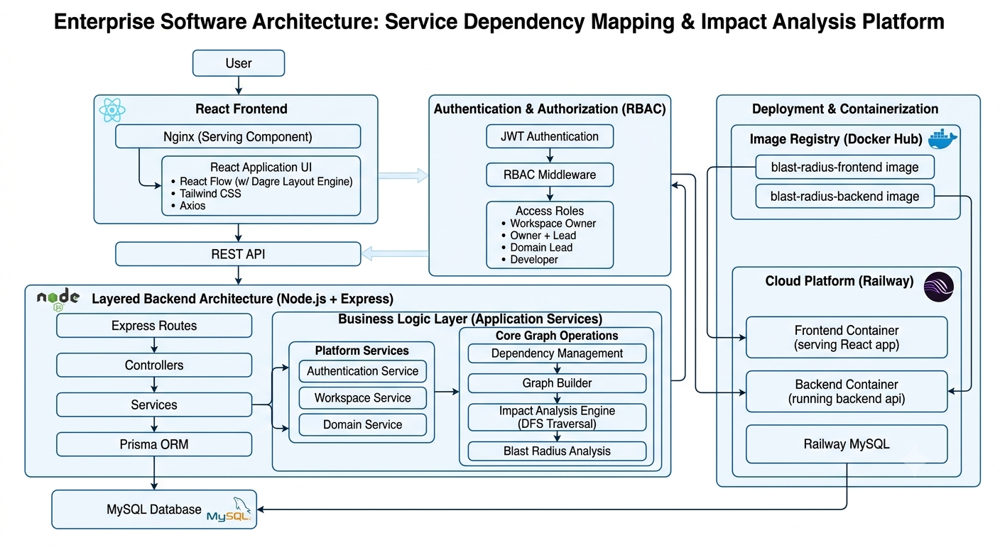

------------------------------------------------------------------------

## 🛡️ Role-Based Access Control (RBAC)

  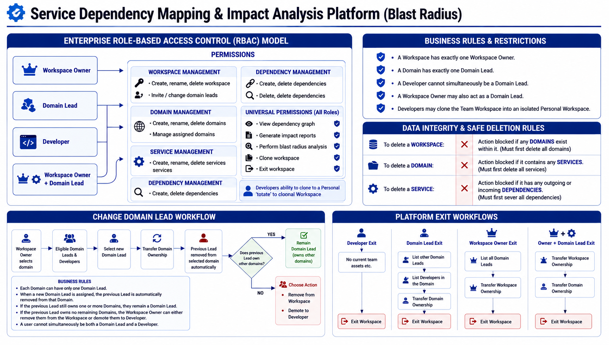

------------------------------------------------------------------------

# 🐳 Deployment

  | Component | Technology |
|-----------|------------|
| Frontend | React + Vite + Docker + Nginx |
| Backend | Node.js + Express + Docker |
| Database | Railway MySQL |
| ORM | Prisma |
| Cloud | Railway |
| Container Registry | Docker Hub |

------------------------------------------------------------------------

# 📸 Application Screenshots

## 🔐 Login

  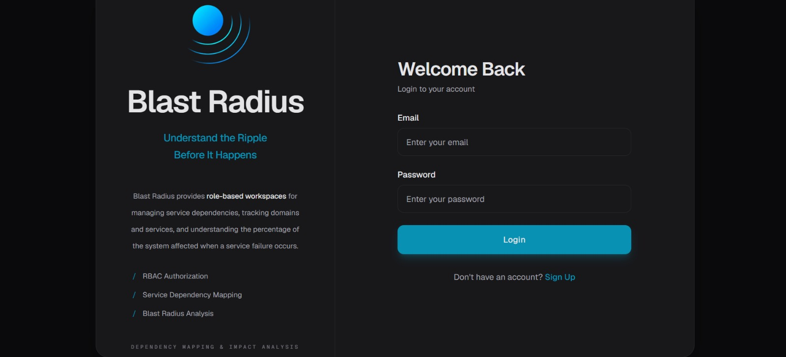

Secure JWT-based authentication with Role-Based Access Control.

---

## 📊 Dashboard

  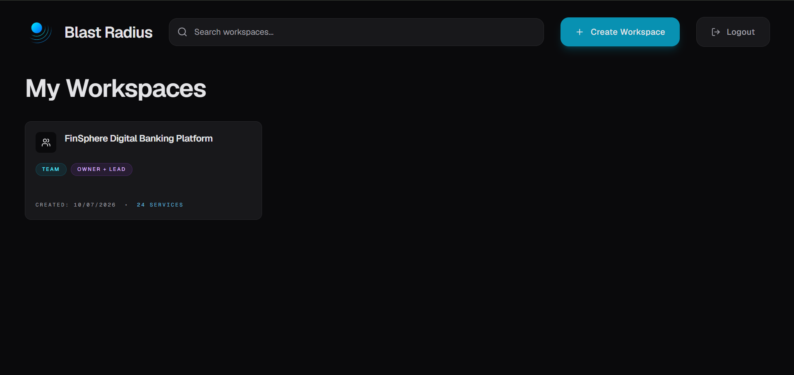

Centralized dashboard for creating, joining, and managing workspaces.

---

## 👑 Workspace Owner Dashboard

  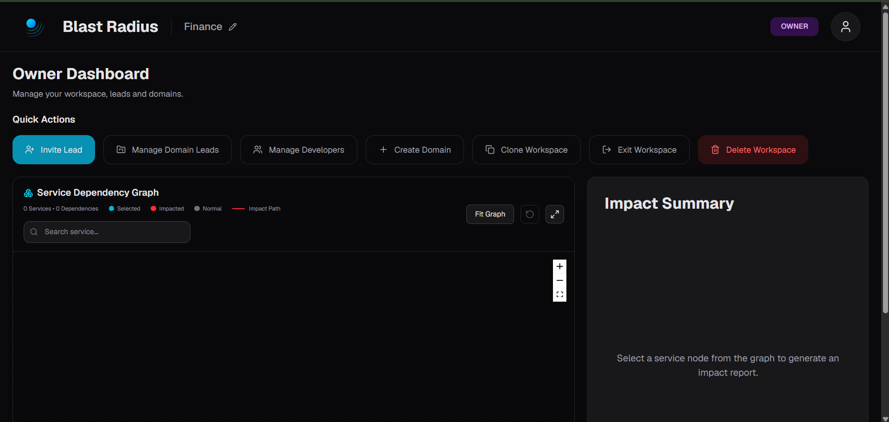

Manage workspaces, domains, services, dependencies, developers, and generate impact reports.

---

## 👨‍💼 Owner + Domain Lead Dashboard

  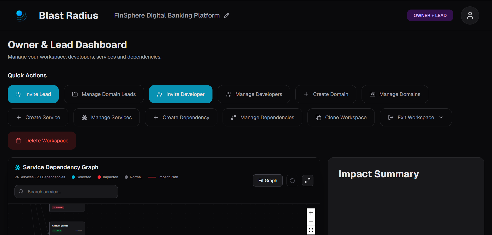

Combined permissions for users acting as both Workspace Owner and Domain Lead.

---

## 👨‍💻 Domain Lead Dashboard

  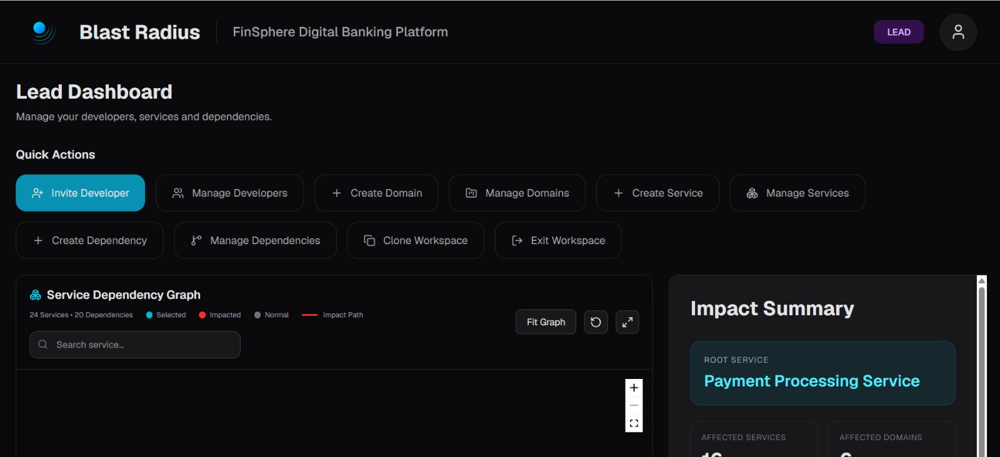

Manage assigned domains, services, dependencies, and collaborate with developers.

---

## 🧑‍💻 Developer Dashboard

  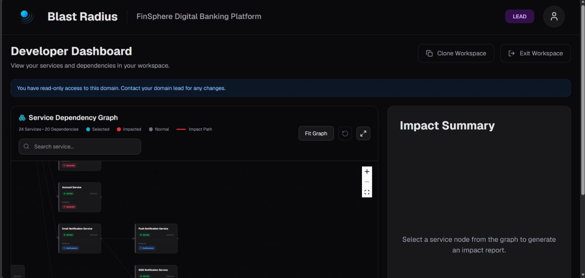

Developers have read-only access to the team workspace and can clone it into an isolated personal workspace.

---

## 🧪 Personal Workspace

  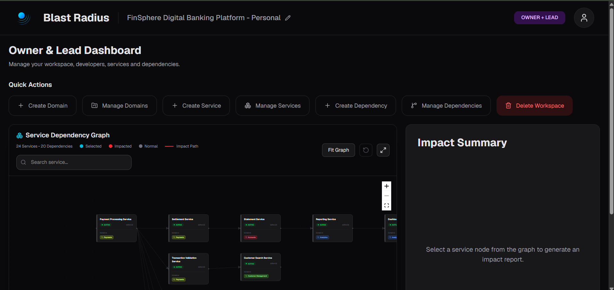

Clone an entire team workspace into a personal workspace for experimentation and independent development.

An isolated environment where developers can safely modify services and dependencies without affecting the shared workspace.

---

## 🌐 Service Dependency Graph

  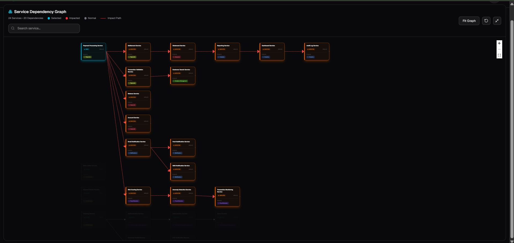

Interactive dependency visualization with automatic graph layout, search, zoom, fullscreen mode, and dependency navigation.

---

## 💥 Blast Radius Analysis

  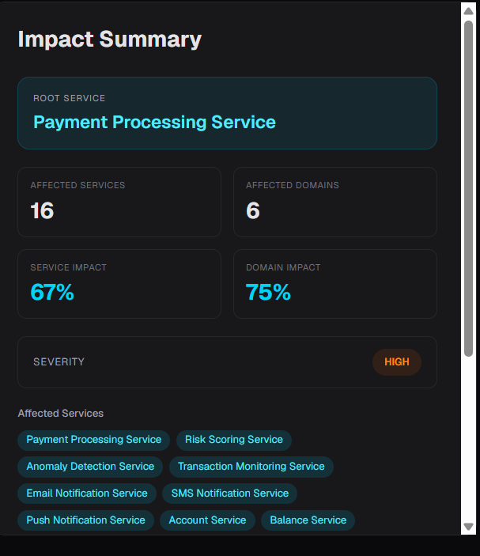

  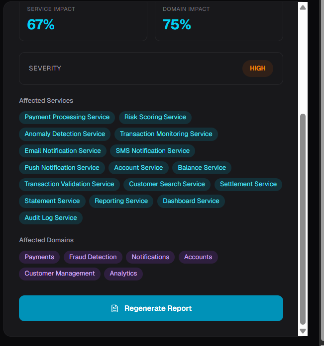

Depth First Search (DFS) based traversal highlights impacted services and dependency paths while generating comprehensive impact reports.

------------------------------------------------------------------------

# ✨ Features

## Workspace Management

-   Team Workspaces
-   Personal Workspaces
-   Clone Team Workspace into Personal Workspace
-   Rename Workspace
-   Delete Workspace
-   Leave Workspace

## Domain Management

-   Create Domains
-   Rename Domains
-   Delete Domains
-   Assign / Change Domain Leads
-   Invite Leads & Developers

## Service Management

-   Create / Rename / Delete Services

## Dependency Management

-   Create/Delete Dependencies
-   Duplicate Dependency Prevention
-   Automatic Graph Layout (Dagre)

## Blast Radius Analysis

-   DFS Traversal
-   Impact Report Generation
-   Highlight Impacted Services
-   Highlight Dependency Paths
-   Search & Auto Zoom
-   Reset Analysis

## Security

-   JWT Authentication
-   BCrypt Password Hashing
-   RBAC
-   Middleware Authorization

------------------------------------------------------------------------

# 🛠 Tech Stack

-   React, Vite, Tailwind CSS
-   React Flow, Dagre
-   Node.js, Express.js
-   Prisma ORM
-   MySQL
-   Docker
-   Railway

------------------------------------------------------------------------

# 🚀 Future Enhancements

-   Graph Versioning
-   Redis Caching
-   Automatic Dependency Graph Generation
-   Graph & Report Export (PNG/PDF)
-   Audit Logging
-   Notification Service
-   Real-Time Collaboration

------------------------------------------------------------------------

# 👨‍💻 Authors

- **Muppidi Sai Adithya**  
  

- **Rongali Shanmukha Siddarth**  
  
